 
<p align="center">  </p>

# <h1 align="center">Swipeat</h1>
<p align="center">
Swipeat is a simple and efficient meal tracking <strong> AI Powered </strong>  <strong> cross-platform </strong>App.  
Add meals once, then swipe daily to log them — fast, easy, and consistent. (AVAILABLE ON ANDORID <a href="https://apkpure.com/p/com.annous246.react_native_app">DOWNLOAD</a>)
</p>


 


## Backend
 
 
 


## DataBase
 

## AI


[](#)


(soon on [](#) )

---

## ✨ Features

- 🥗 Add your meals one time only with AI
- 👆 Swipe daily to log meals instantly
- 📊 Track your eating habits with ease
- 📱 Clean and minimal UI
- 🤖 Powered by AI using OpenAI to assist with meal tracking and suggestions
## 🚀 Installation

```bash


## 🚀 Getting Started

### Prerequisites
- [Node.js](https://nodejs.org/) (LTS recommended)
- [Expo CLI](https://docs.expo.dev/get-started/installation/)
- [Expo Go app](https://expo.dev/go?sdkVersion=52&platform=android&device=true)

### Installation

```bash
# Clone the repository
git clone https://github.com/username/swipeat.git

# Navigate into the project
cd swipeat

# Install dependencies
npm install
npx expo start --lan
```
## 📱 Screenshots
<p align="center"> 
 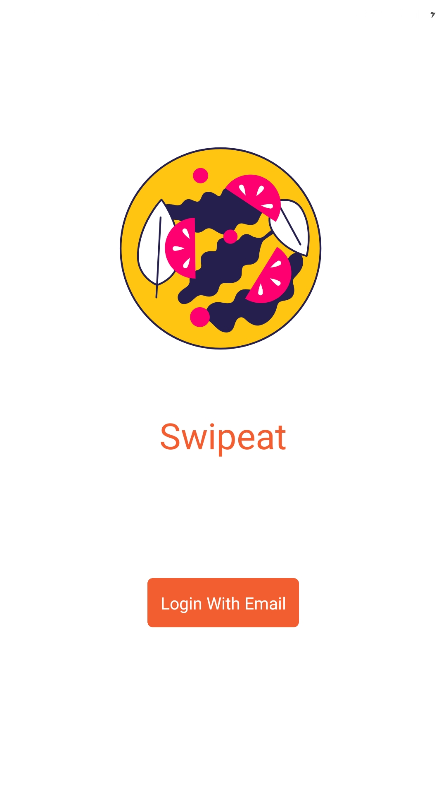 
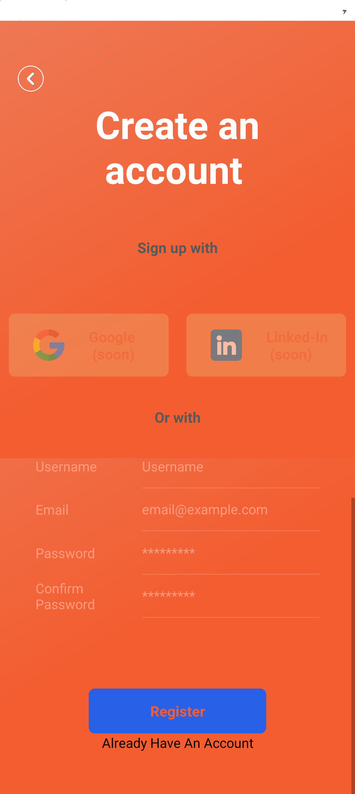 
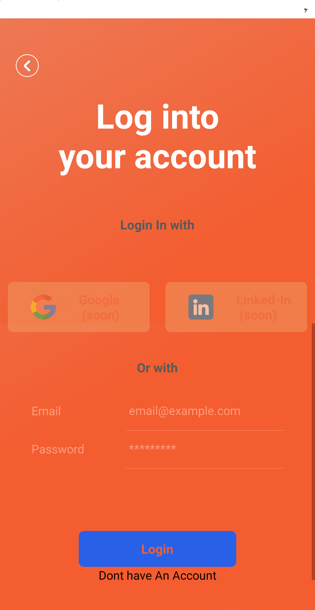 
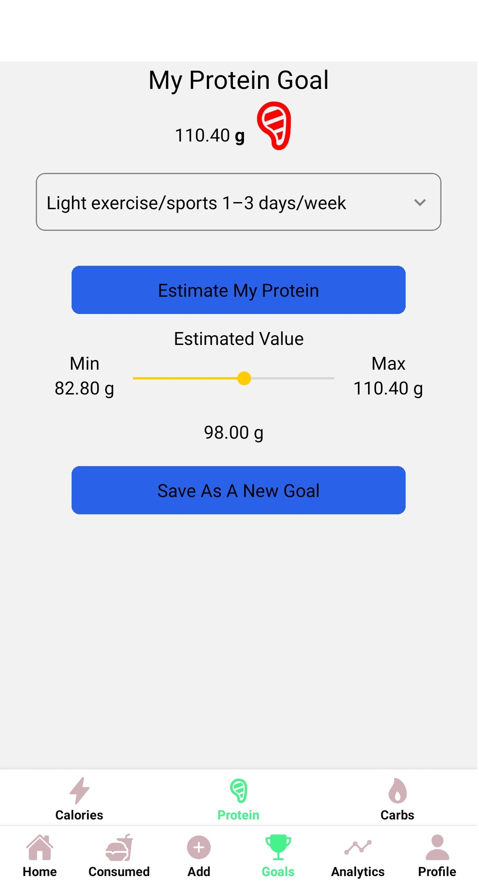 
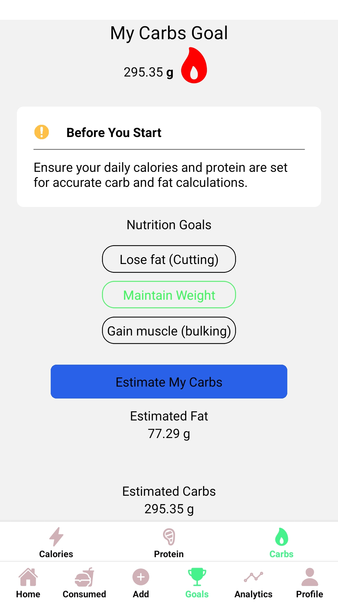 
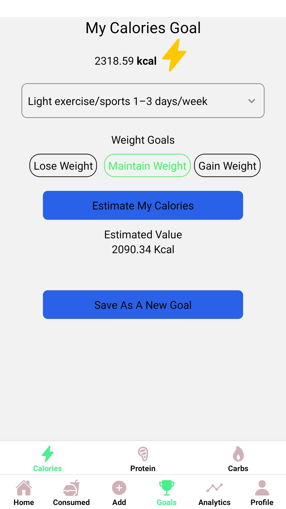 
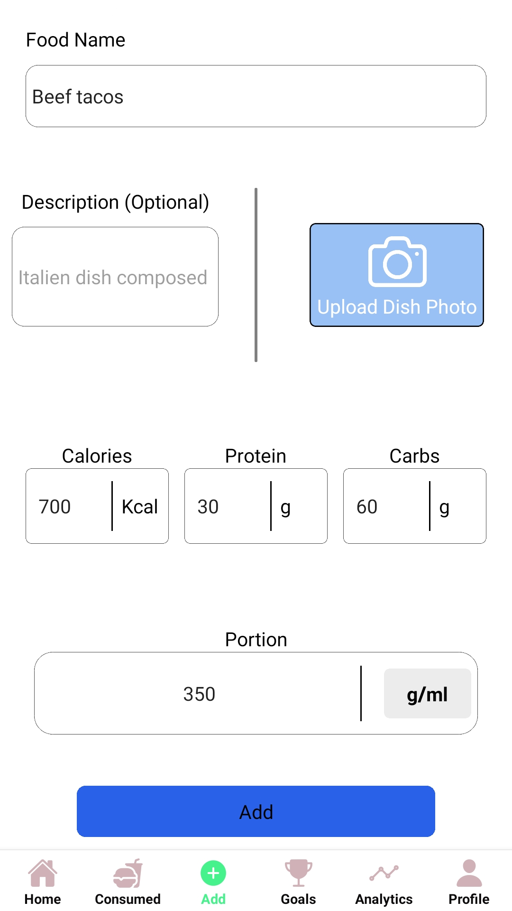 
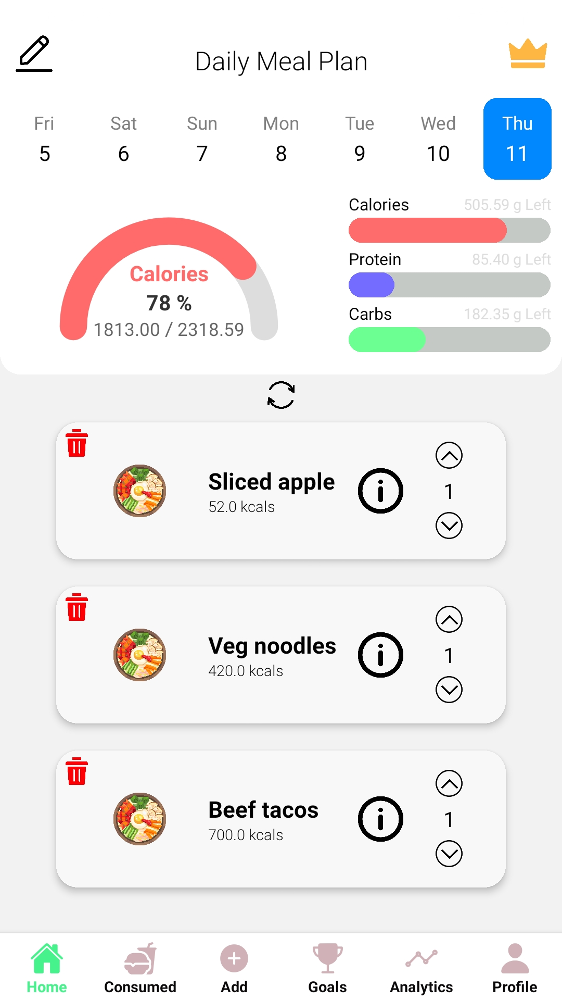 
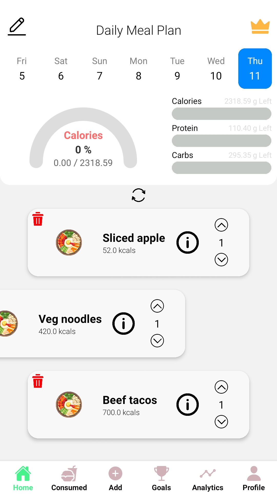 
 
 
 
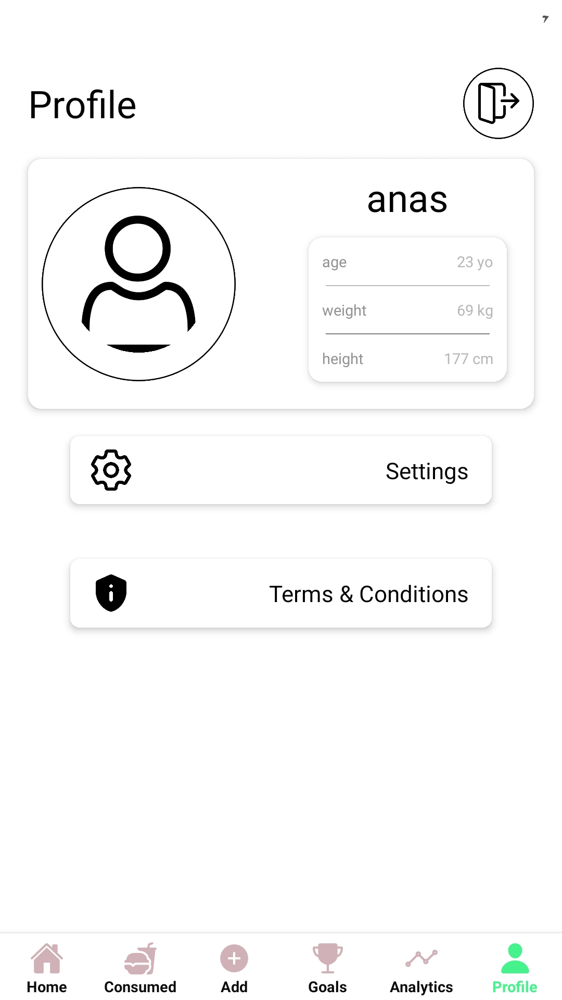 
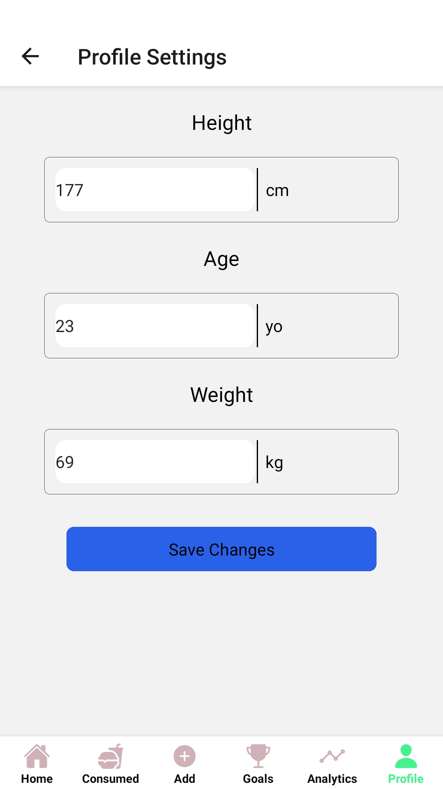 
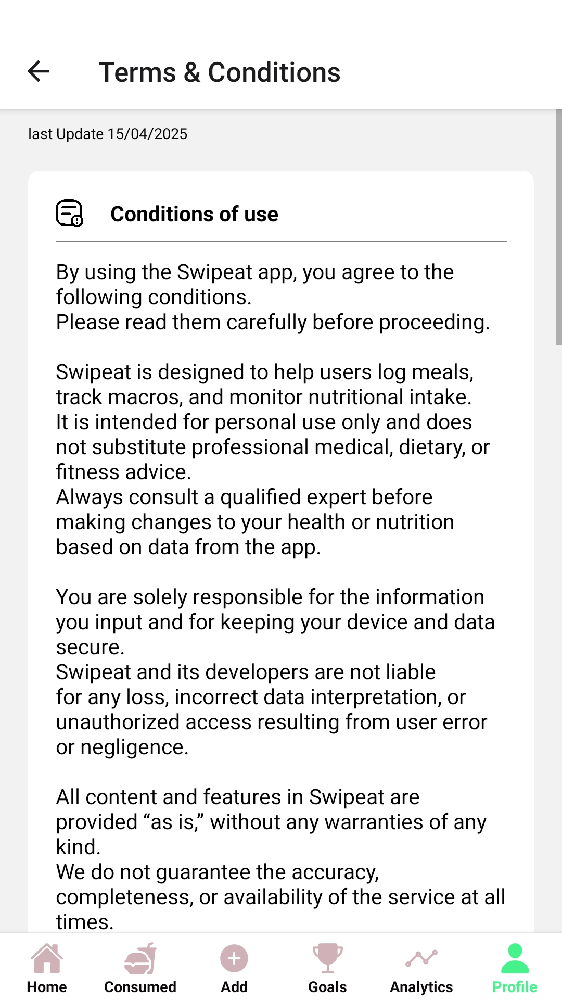 

</p>


## 🛠️ Tech Stack

React Native

Expo

## 🤝 Contributing

This is a private project, but feel free to fork it or suggest improvements.

## 📄 License

This project is licensed under the MIT License.
See the LICENSE
 file for details.


---
